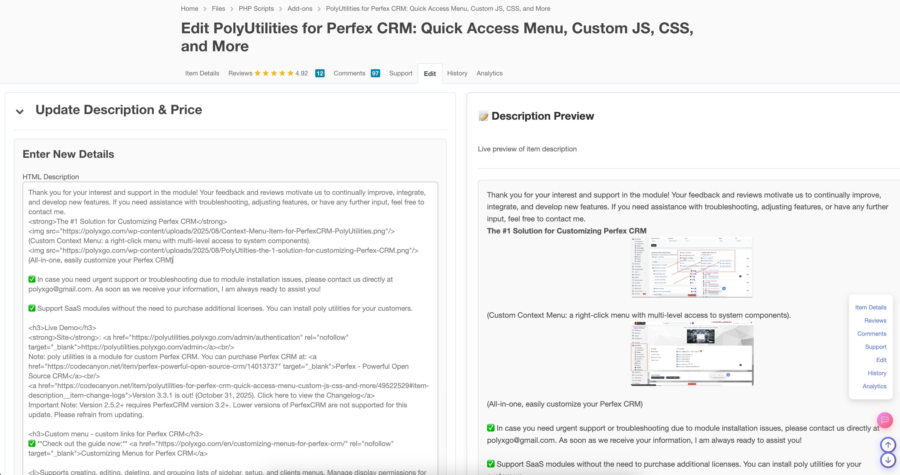
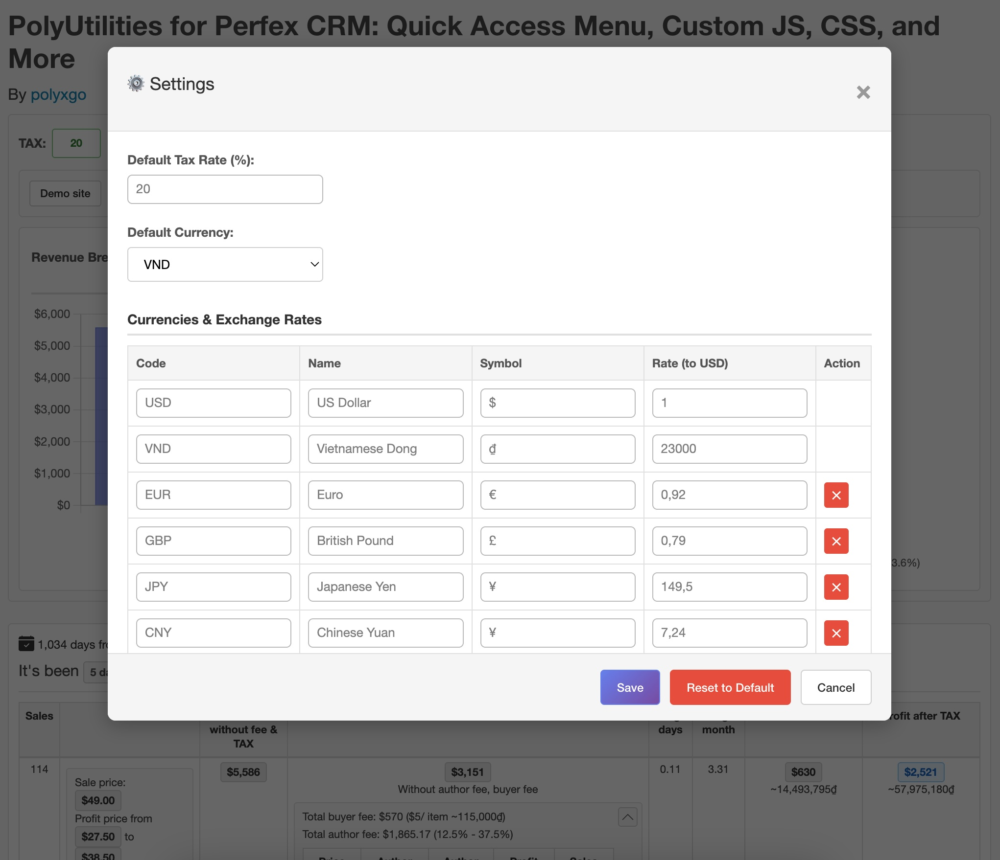
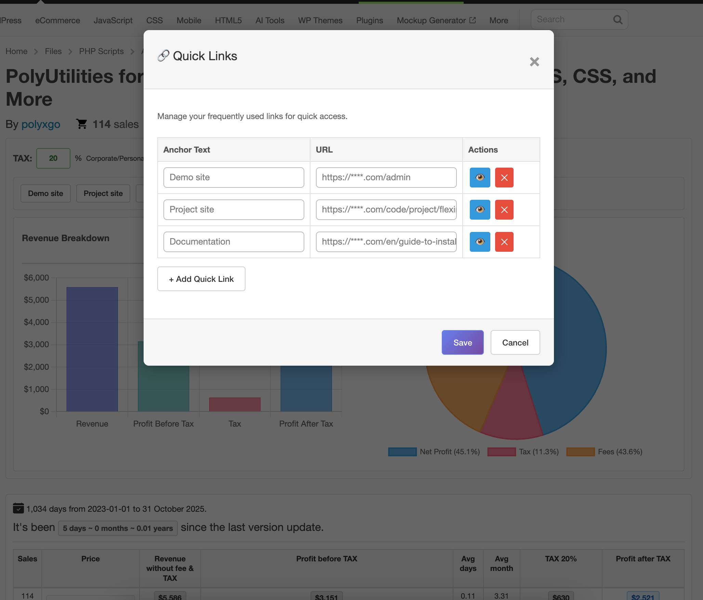
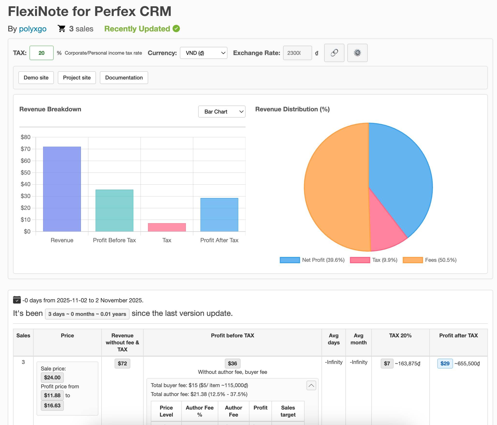
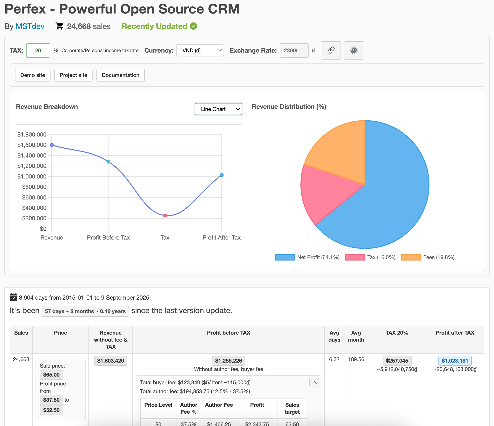
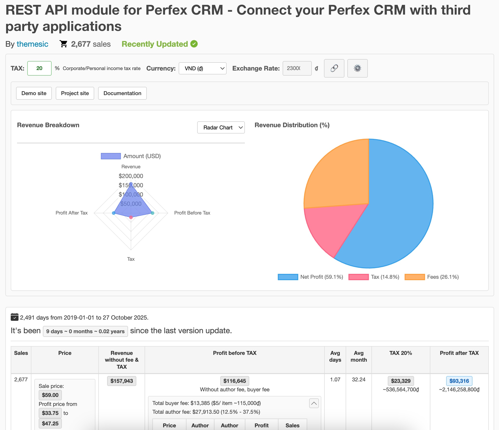

# PolyMetrics
### Product Price Analysis Extension for Envato

This extension supports analyzing product price information on the Envato marketplace for reference data. If you are researching and looking for ideas from existing products on Envato, this extension can assist you to some extent:

- **List product information** along with price levels and sales numbers based on the author fee level table.
- **Estimate revenue and profit** before and after tax for each product.
- **Total days since the product was published** on Envato.
- **Most recent update date:** If this date falls within a few months, the product is still being supported and has users.
- **Quickly follow the author or customers** when viewing reviews and comments.
- **Toolbar for inserting Envato HTML code** to assist in customer responses.

  
**If you find this source code helpful, consider buying me a coffee to support my work!** ☕

### Planned Features:

- **Store a list of product information** for comparison purposes.
- **Classify stored lists** by different product feature groups.

P/S: Since this extension serves our work needs, if you use it and feel any feature is necessary, feel free to contribute, and I'll integrate it!

### Installation:

1. Download the PolyMetrics folder and navigate to `chrome://extensions/` in Chrome.
2. Enable **Developer mode**. I am currently working on completing and adding features to the Chrome Webstore soon!
3. Then, **Load unpacked** and select the PolyMetrics folder. Activate the extension.
4. Visit Codecanyon or ThemeForest to use it!

### Changelogs:
- **Charts**: Provides visual charts to compare revenue, expenses, taxes, and more.
- **Exchange Rate Settings**: Supports integration of any currency exchange rates to estimate revenue/profit based on the author’s preferred currency.
- **Tax Settings**: Allows integration of custom tax rates for easy reference. Since individuals and companies may have different tax rules, this feature makes it convenient to adjust accordingly.
- **Interface Update**: Refines the design style to minimize layout changes to Envato’s interface.
- **Tools**: Adds utilities such as scroll to top/bottom and fixed Envato tab lists (Product Info, Analytics, Support, History, etc.) for quick access from anywhere on the page — reducing time spent switching between Envato tabs.
- **Description Editor**: Enables live preview of detailed product descriptions while editing HTML, providing a more visual editing experience and helping authors avoid unwanted HTML tag errors.
- **Related Links**: Allows authors to set up related links for product development within their system — such as documentation links, internal project info links, or demo links. This helps authors quickly navigate to relevant work areas for editing or updating, reducing workflow time.

### ScreenShot

  
**If you find this source code helpful, consider buying me a coffee to support my work!** ☕

