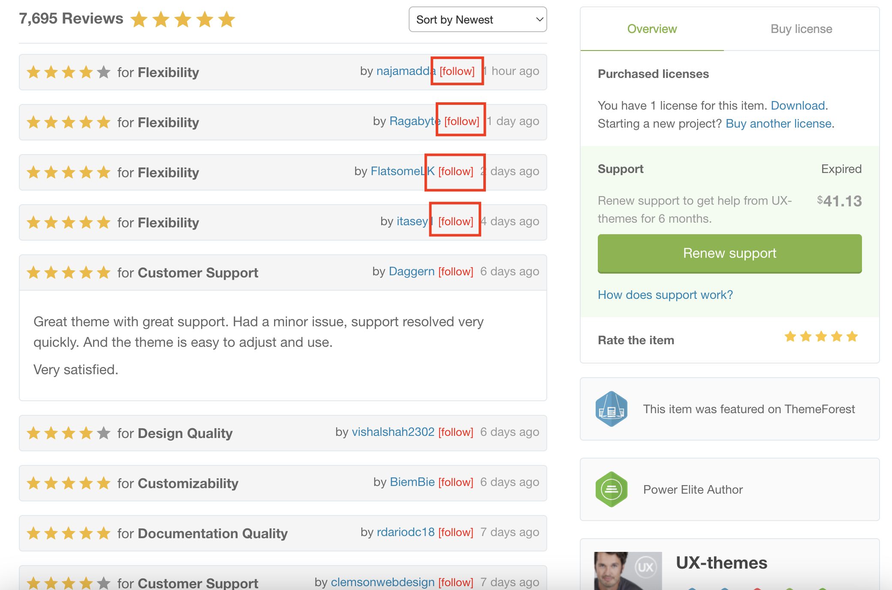
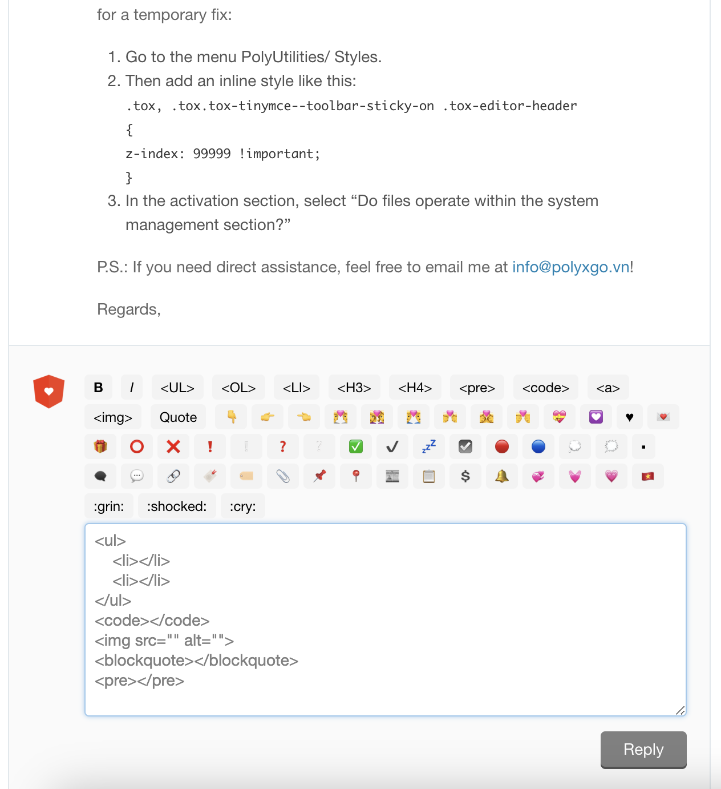
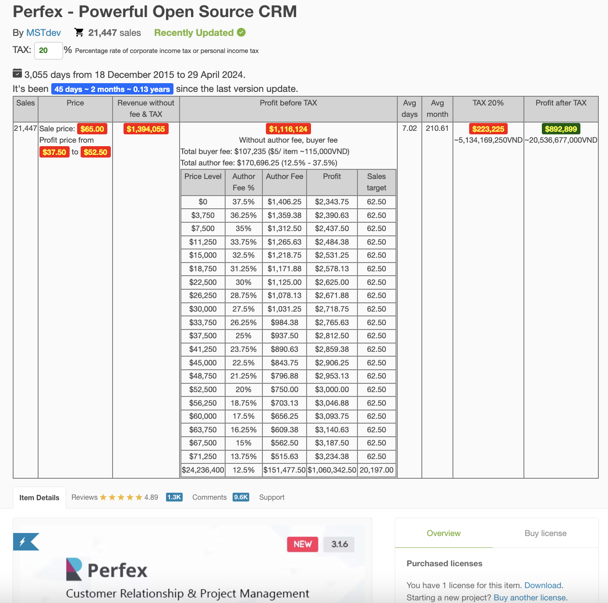
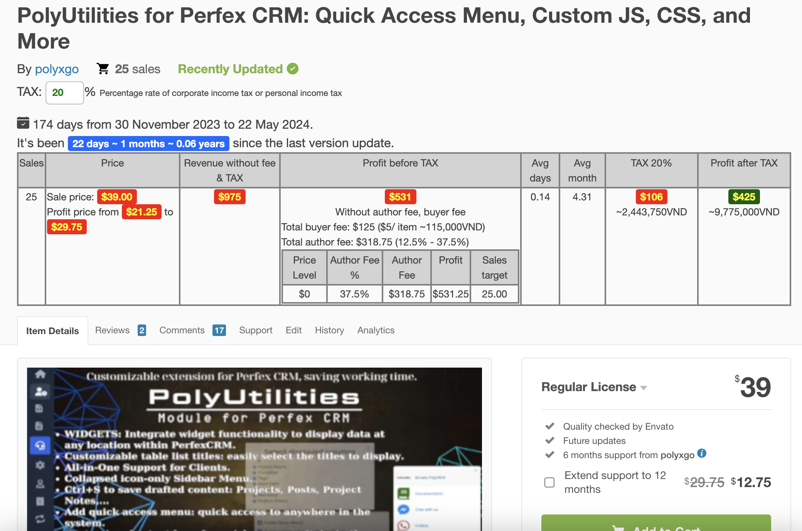
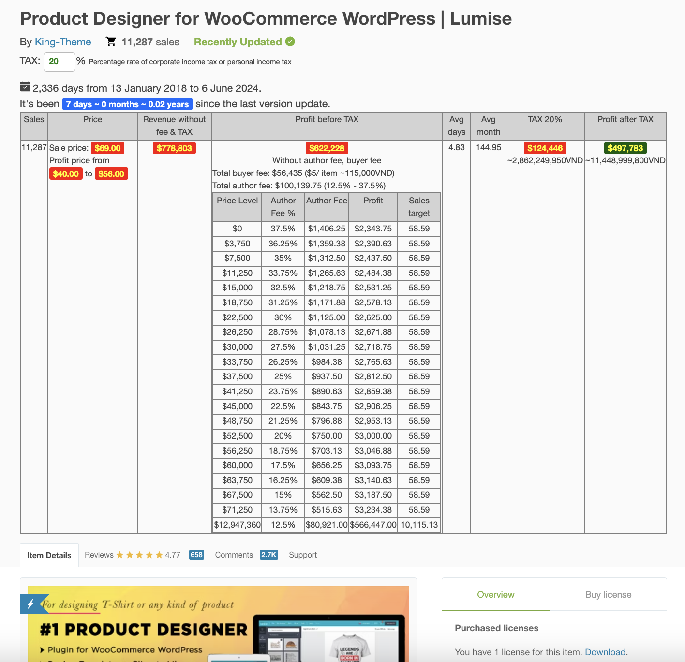
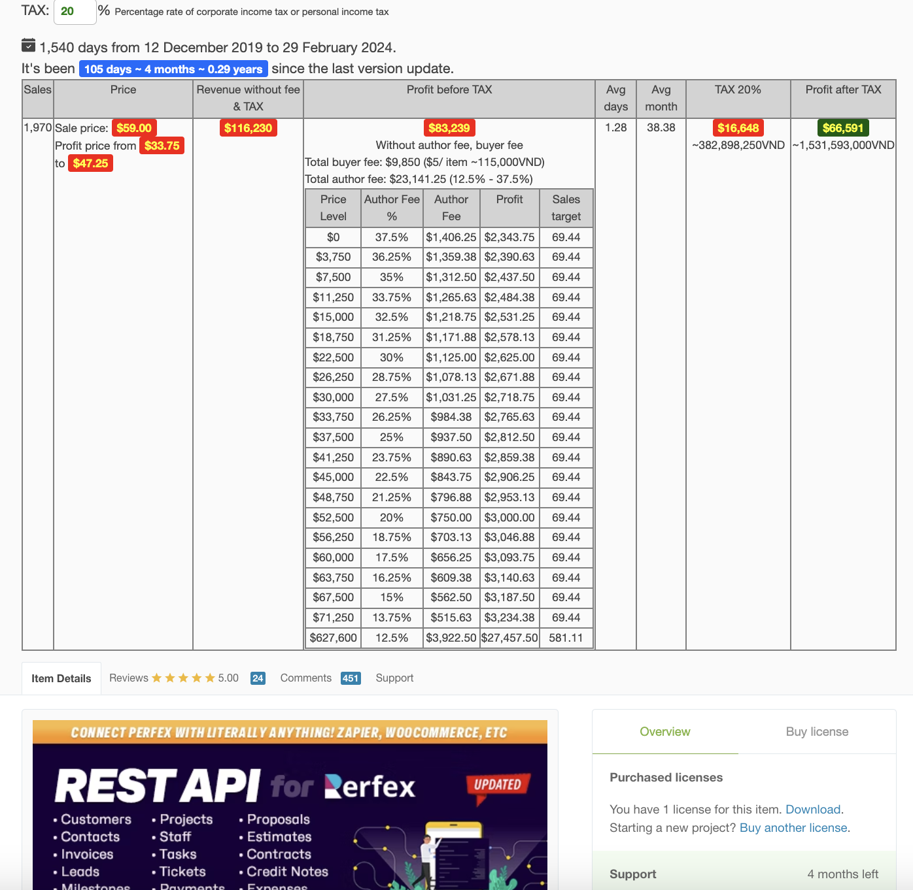

# PolyMetrics
### Product Price Analysis Extension for Envato

This extension supports analyzing product price information on the Envato marketplace for reference data. If you are researching and looking for ideas from existing products on Envato, this extension can assist you to some extent:

- **List product information** along with price levels and sales numbers based on the author fee level table.
- **Estimate revenue and profit** before and after tax for each product.
- **Total days since the product was published** on Envato.
- **Most recent update date:** If this date falls within a few months, the product is still being supported and has users.
- **Quickly follow the author or customers** when viewing reviews and comments.
- **Toolbar for inserting Envato HTML code** to assist in customer responses.

### Planned Features:

- **Store a list of product information** for comparison purposes.
- **Classify stored lists** by different product feature groups.

P/S: Since this extension serves our work needs, if you use it and feel any feature is necessary, feel free to contribute, and I'll integrate it!

### Installation:

1. Download the PolyMetrics folder and navigate to `chrome://extensions/` in Chrome.
2. Enable **Developer mode**. I am currently working on completing and adding features to the Chrome Webstore soon!
3. Then, **Load unpacked** and select the PolyMetrics folder. Activate the extension.
4. Visit Codecanyon or ThemeForest to use it!

### ScreenShot

