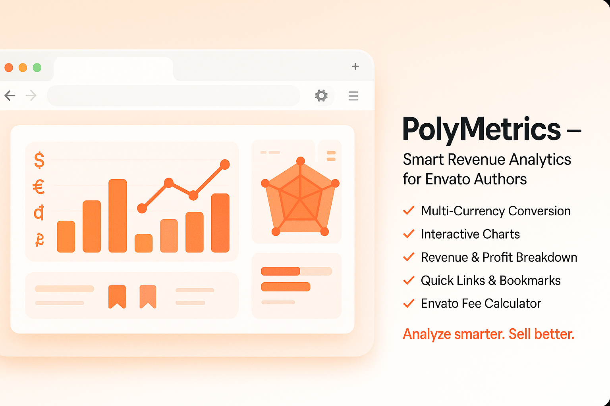
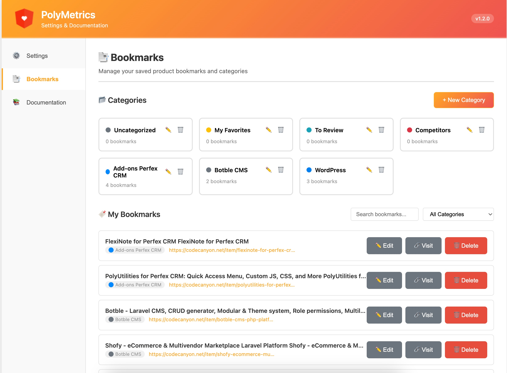

# PolyMetrics
### Product Price Analysis Extension for Envato

This extension supports analyzing product price information on the Envato marketplace for reference data. If you are researching and looking for ideas from existing products on Envato, this extension can assist you to some extent:

### 📊 Analytics Features:
- **List product information** along with price levels and sales numbers based on the author fee level table.
- **Estimate revenue and profit** before and after tax for each product.
- **Interactive Charts:** Bar, Line, Radar, Polar Area, and Pie charts for data visualization.
- **Multi-Currency Support:** Convert amounts to 17+ currencies with real-time exchange rates.
- **Total days since the product was published** on Envato.
- **Most recent update date:** If this date falls within a few months, the product is still being supported and has users.

### 📑 Bookmark System:
- **Save Product Pages:** Click bookmark icon next to any product title to save it.
- **Category Management:** Organize bookmarks with custom categories and colors.
- **Quick Access Panel:** Floating panel on right side shows all your bookmarks grouped by categories.
- **Edit & Delete:** Update bookmark titles, change categories, or remove bookmarks.
- **Persistent State:** Panel remembers if you had it open when you reload the page.
- **Search & Filter:** Find bookmarks by title or filter by specific category.
- **Smart Icons:** Visual indicator shows saved (filled) vs unsaved (outline) state.

### 🔧 Productivity Tools:
- **Quick Links:** Save frequently used links per product page for easy access.
- **Description Editor:** Live preview of product descriptions while editing HTML.
- **Quickly follow the author or customers** when viewing reviews and comments.
- **Toolbar for inserting Envato HTML code** to assist in customer responses.
- **Fixed Navigation:** Scroll to top/bottom and quick access to Envato tabs from anywhere.

  
**If you find this source code helpful, consider buying me a coffee to support my work!** ☕

### How to Use Bookmarks:

1. **Add Bookmark:**
   - Navigate to any product page on CodeCanyon or ThemeForest
   - Click the bookmark icon (📑) next to the product title
   - Select a category or create a new one
   - Click "Save Bookmark"

2. **View Bookmarks:**
   - Click the floating bookmark button (📑) on the right side
   - A panel will slide in from the right showing all your bookmarks
   - Bookmarks are grouped by categories with color-coded labels

3. **Edit Bookmark:**
   - Click the bookmarked icon on any saved product page
   - Edit the title or change the category
   - Click "Save Change" or "Delete" to remove

4. **Manage Categories:**
   - Open extension settings (click extension icon → Settings)
   - Go to "Bookmarks" tab
   - Add, edit, or delete categories
   - Each category can have a custom color

### Bookmark Features:

- **Smart Icons:** Filled bookmark icon = saved, outline = not saved
- **Category Colors:** Visual organization with custom colors
- **Persistent Panel:** Panel state remembers if you had it open
- **Quick Access:** Click any bookmark to visit the product page
- **Search & Filter:** Find bookmarks by title or filter by category
- **Import/Export:** All data stored in Chrome sync storage

### Planned Features:

- **Store a list of product information** for comparison purposes.
- **Classify stored lists** by different product feature groups.
- **Bookmark sync across devices** via Chrome sync storage.

P/S: Since this extension serves our work needs, if you use it and feel any feature is necessary, feel free to contribute, and I'll integrate it!

### Installation:

1. Download the PolyMetrics folder and navigate to `chrome://extensions/` in Chrome.
2. Enable **Developer mode**. I am currently working on completing and adding features to the Chrome Webstore soon!
3. Then, **Load unpacked** and select the PolyMetrics folder. Activate the extension.
4. Visit Codecanyon or ThemeForest to use it!

### Changelogs:

**v1.2.0 - Bookmark System:**
- **Bookmark Management**: Save and organize product pages with categories
- **Category System**: Create custom categories with color coding for visual organization
- **Quick Access Panel**: Slide-in panel from right side showing all saved bookmarks
- **Edit Bookmarks**: Change titles, move between categories, or delete bookmarks
- **Persistent State**: Panel remembers open/closed state across page reloads
- **Search & Filter**: Find bookmarks by title or filter by category
- **Smart Icons**: Visual indicators for saved (filled) vs unsaved (outline) state

**v1.1.0 - Enhanced Analytics:**
- **Charts**: Provides visual charts to compare revenue, expenses, taxes, and more.
- **Exchange Rate Settings**: Supports integration of any currency exchange rates to estimate revenue/profit based on the author's preferred currency.
- **Tax Settings**: Allows integration of custom tax rates for easy reference. Since individuals and companies may have different tax rules, this feature makes it convenient to adjust accordingly.

**v1.0.0 - Initial Release:**
- **Interface Update**: Refines the design style to minimize layout changes to Envato's interface.
- **Tools**: Adds utilities such as scroll to top/bottom and fixed Envato tab lists (Product Info, Analytics, Support, History, etc.) for quick access from anywhere on the page — reducing time spent switching between Envato tabs.
- **Description Editor**: Enables live preview of detailed product descriptions while editing HTML, providing a more visual editing experience and helping authors avoid unwanted HTML tag errors.
- **Related Links**: Allows authors to set up related links for product development within their system — such as documentation links, internal project info links, or demo links. This helps authors quickly navigate to relevant work areas for editing or updating, reducing workflow time.

### ScreenShot

  
**If you find this source code helpful, consider buying me a coffee to support my work!** ☕

