# PolyMetrics
### Product Price Analysis Extension for Envato

This extension supports analyzing product price information on the Envato marketplace for reference data. If you are researching and looking for ideas from existing products on Envato, this extension can assist you to some extent:

<div><a href="https://www.youtube.com/watch?v=Oed6HvHlfBw" rel="nofollow" target="_blank">WATCH the VIDEO</a></div>

### 📊 Analytics Features:
- **List product information** along with price levels and sales numbers based on the author fee level table.
- **Estimate revenue and profit** before and after tax for each product.
- **Interactive Charts:** Bar, Line, Radar, Polar Area, and Pie charts for data visualization.
- **Multi-Currency Support:** Convert amounts to 17+ currencies with real-time exchange rates.
- **Total days since the product was published** on Envato.
- **Most recent update date:** If this date falls within a few months, the product is still being supported and has users.

### 📑 Bookmark System:
- **Save Product Pages:** Click bookmark icon next to any product title to save it.
- **Category Management:** Organize bookmarks with custom categories and colors.
- **Quick Access Panel:** Floating panel on right side shows all your bookmarks grouped by categories.
- **Edit & Delete:** Update bookmark titles, change categories, or remove bookmarks.
- **Persistent State:** Panel remembers if you had it open when you reload the page.
- **Search & Filter:** Find bookmarks by title or filter by specific category.
- **Smart Icons:** Visual indicator shows saved (filled) vs unsaved (outline) state.

### 🔧 Productivity Tools:
- **Quick Links:** Save frequently used links per product item for easy access. Quick Links are shared across all related pages (main, reviews, comments, support) of the same item using item ID as the grouping key.
- **Description Editor:** Live preview of product descriptions while editing HTML.
- **Quickly follow the author or customers** when viewing reviews and comments.
- **Toolbar for inserting Envato HTML code** to assist in customer responses.
- **Smart List Formatting:** Automatically format selected text into ordered (`<ol>`) or unordered (`<ul>`) lists. When you select multiple lines of text and click the `<OL>` or `<UL>` button, each line is automatically wrapped with `<li>` tags for quick list creation.
- **Copy Comment Content:** One-click copy button next to each comment author name to quickly copy the entire comment content to clipboard. Works for both main comments and comment responses.
- **Smart Anchor Links:** When selecting text and clicking the `<a>` button, if the selected text is a URL, it automatically uses it as both the href and anchor text. Otherwise, it creates a link with `#` as href.
- **Fixed Navigation:** Scroll to top/bottom and quick access to Envato tabs from anywhere.

<div align="center">
  
**If you find this source code helpful, consider buying me a coffee to support my work!** ☕

<a href="https://paypal.me/polyxgo" target="_blank">
  
</a>
</div>

### How to Use Comment Tools:

1. **Smart List Formatting:**
   - Select multiple lines of text in the comment editor
   - Click the `<OL>` button for ordered lists or `<UL>` for unordered lists
   - Each line will be automatically wrapped with `<li>` tags
   - Example: Select three lines and click `<OL>` to create a numbered list

2. **Copy Comment Content:**
   - Look for the "Copy" button next to any comment author's name
   - Click it to instantly copy the entire comment content to your clipboard
   - Works for both main comments and comment responses
   - The button shows "Copied!" feedback when successful

3. **Smart Anchor Links:**
   - Select text in the comment editor
   - Click the `<a>` button
   - If the selected text is a URL (starts with http:// or https://), it will be used as both the link and display text
   - If it's regular text, it will create a link with `#` as the href

### How to Use Quick Links:

1. **Add Quick Links:**
   - Navigate to any product page (main, reviews, comments, or support page)
   - Click the 🔗 icon in the toolbar
   - Add anchor text (display name) and URL for each link
   - Click "View" (👁️) to open link or "Remove" (✕) to delete
   - Click "Save" to save your Quick Links

2. **View Quick Links:**
   - Quick Links appear below the toolbar on product pages
   - Click any Quick Link to open it in a new tab

3. **Unified Quick Links:**
   - Quick Links are shared across all related pages of the same item
   - When you save Quick Links on any page (main, reviews, comments, support), they will appear on all related pages
   - Example: Adding Quick Links on `/item/name/123456/reviews` will make them available on `/item/name/123456`, `/item/name/123456/comments`, and `/item/name/123456/support`
   - This is because the extension uses the item ID to group related pages together

### How to Use Bookmarks:

1. **Add Bookmark:**
   - Navigate to any product page on CodeCanyon or ThemeForest
   - Click the bookmark icon (📑) next to the product title
   - Select a category or create a new one
   - Click "Save Bookmark"

2. **View Bookmarks:**
   - Click the floating bookmark button (📑) on the right side
   - A panel will slide in from the right showing all your bookmarks
   - Bookmarks are grouped by categories with color-coded labels

3. **Edit Bookmark:**
   - Click the bookmarked icon on any saved product page
   - Edit the title or change the category
   - Click "Save Change" or "Delete" to remove

4. **Manage Categories:**
   - Open extension settings (click extension icon → Settings)
   - Go to "Bookmarks" tab
   - Add, edit, or delete categories
   - Each category can have a custom color

5. **Smart Bookmark Recognition:**
   - Bookmarks are automatically normalized to the main product page URL
   - All related pages (reviews, comments, support) are treated as the same bookmark
   - Example: Bookmarking `/item/name/123456/reviews` will save as `/item/name/123456`
   - The bookmark icon will show as "bookmarked" on all related pages of the same item

### Bookmark Features:

- **Smart Icons:** Filled bookmark icon = saved, outline = not saved
- **Category Colors:** Visual organization with custom colors
- **Persistent Panel:** Panel state remembers if you had it open
- **Quick Access:** Click any bookmark to visit the product page
- **Search & Filter:** Find bookmarks by title or filter by category
- **Import/Export:** All data stored in Chrome sync storage
- **Unified Bookmarking:** All related pages (main, reviews, comments, support) share the same bookmark based on item ID

### Planned Features:

- **Store a list of product information** for comparison purposes.
- **Classify stored lists** by different product feature groups.
- **Bookmark sync across devices** via Chrome sync storage.

P/S: Since this extension serves our work needs, if you use it and feel any feature is necessary, feel free to contribute, and I'll integrate it!

### Installation:

1. Download the PolyMetrics folder and navigate to `chrome://extensions/` in Chrome.
2. Enable **Developer mode**. I am currently working on completing and adding features to the Chrome Webstore soon!
3. Then, **Load unpacked** and select the PolyMetrics folder. Activate the extension.
4. Visit Codecanyon or ThemeForest to use it!

### Changelogs:

**v1.2.1 - Comment Tools Enhancement & Unified Link Management:**
- **Smart List Formatting**: Automatically wraps each line with `<li>` tags when selecting text and clicking `<OL>` or `<UL>` buttons in comment editor
- **Copy Comment Feature**: Added one-click copy button next to comment author names to quickly copy comment content to clipboard
- **Smart Anchor Links**: Automatically detects URLs in selected text and uses them as both href and anchor text when creating links
- **Enhanced Comment Toolbar**: Improved comment editing experience with better formatting tools
- **Unified Bookmark System**: Bookmarks are now normalized to main product URLs. All related pages (reviews, comments, support) share the same bookmark based on item ID
- **Unified Quick Links**: Quick Links are now shared across all related pages of the same item (main, reviews, comments, support) using item ID as the grouping key

**v1.2.0 - Bookmark System:**
- **Bookmark Management**: Save and organize product pages with categories
- **Category System**: Create custom categories with color coding for visual organization
- **Quick Access Panel**: Slide-in panel from right side showing all saved bookmarks
- **Edit Bookmarks**: Change titles, move between categories, or delete bookmarks
- **Persistent State**: Panel remembers open/closed state across page reloads
- **Search & Filter**: Find bookmarks by title or filter by category
- **Smart Icons**: Visual indicators for saved (filled) vs unsaved (outline) state

**v1.1.0 - Enhanced Analytics:**
- **Charts**: Provides visual charts to compare revenue, expenses, taxes, and more.
- **Exchange Rate Settings**: Supports integration of any currency exchange rates to estimate revenue/profit based on the author's preferred currency.
- **Tax Settings**: Allows integration of custom tax rates for easy reference. Since individuals and companies may have different tax rules, this feature makes it convenient to adjust accordingly.

**v1.0.0 - Initial Release:**
- **Interface Update**: Refines the design style to minimize layout changes to Envato's interface.
- **Tools**: Adds utilities such as scroll to top/bottom and fixed Envato tab lists (Product Info, Analytics, Support, History, etc.) for quick access from anywhere on the page — reducing time spent switching between Envato tabs.
- **Description Editor**: Enables live preview of detailed product descriptions while editing HTML, providing a more visual editing experience and helping authors avoid unwanted HTML tag errors.
- **Related Links**: Allows authors to set up related links for product development within their system — such as documentation links, internal project info links, or demo links. This helps authors quickly navigate to relevant work areas for editing or updating, reducing workflow time.

### ScreenShot
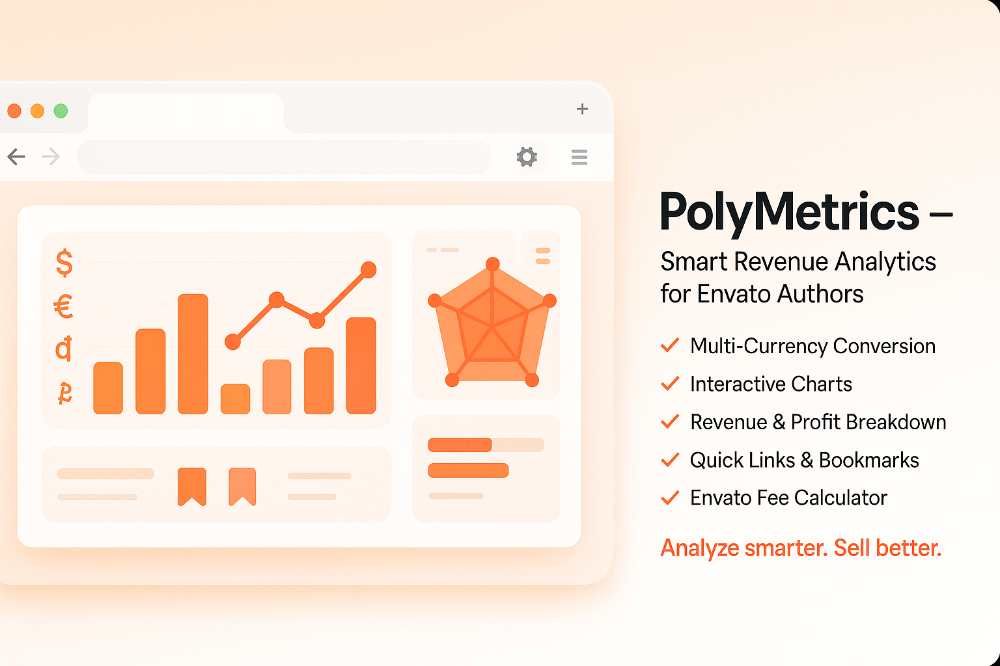

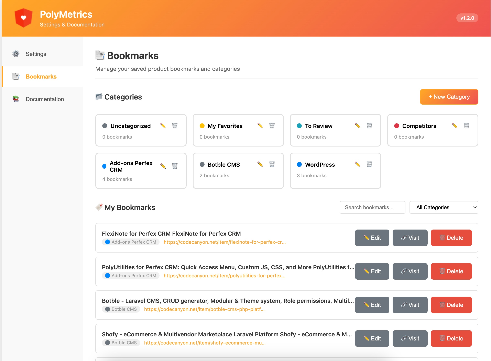

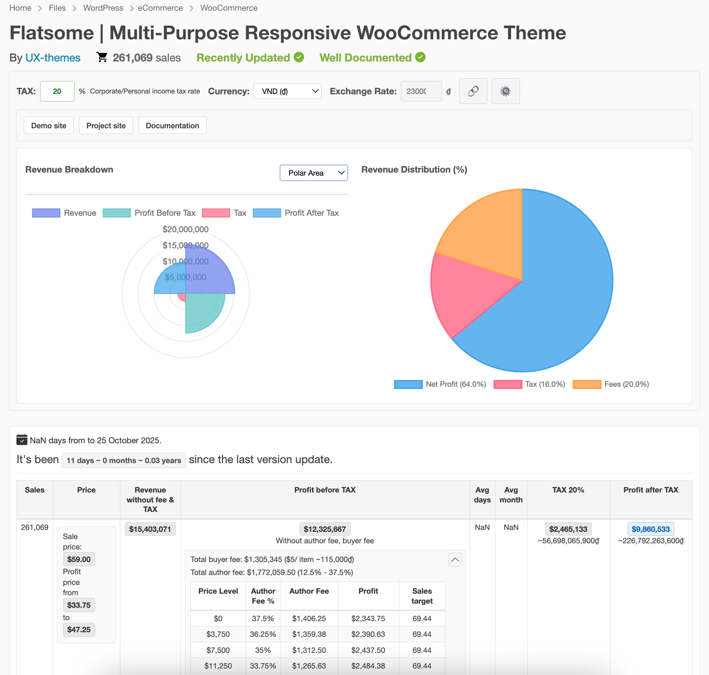

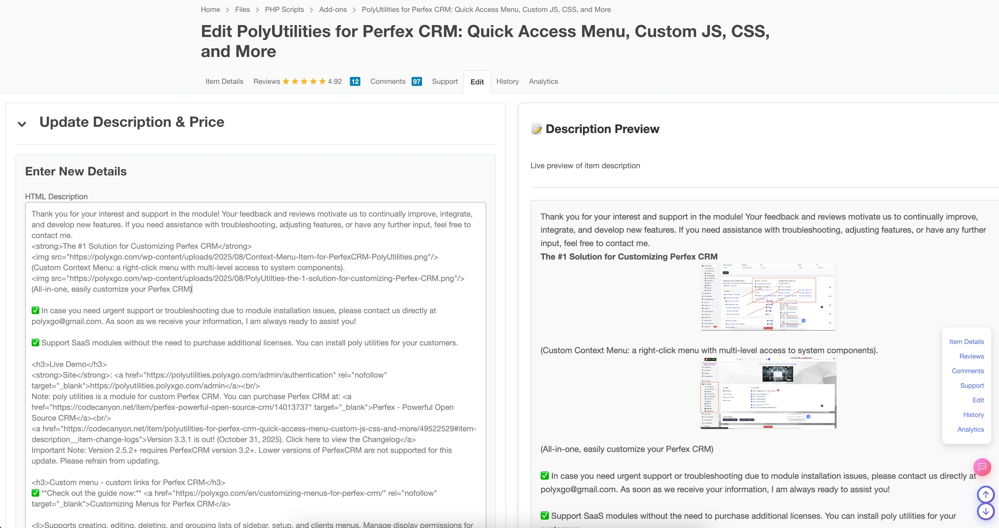

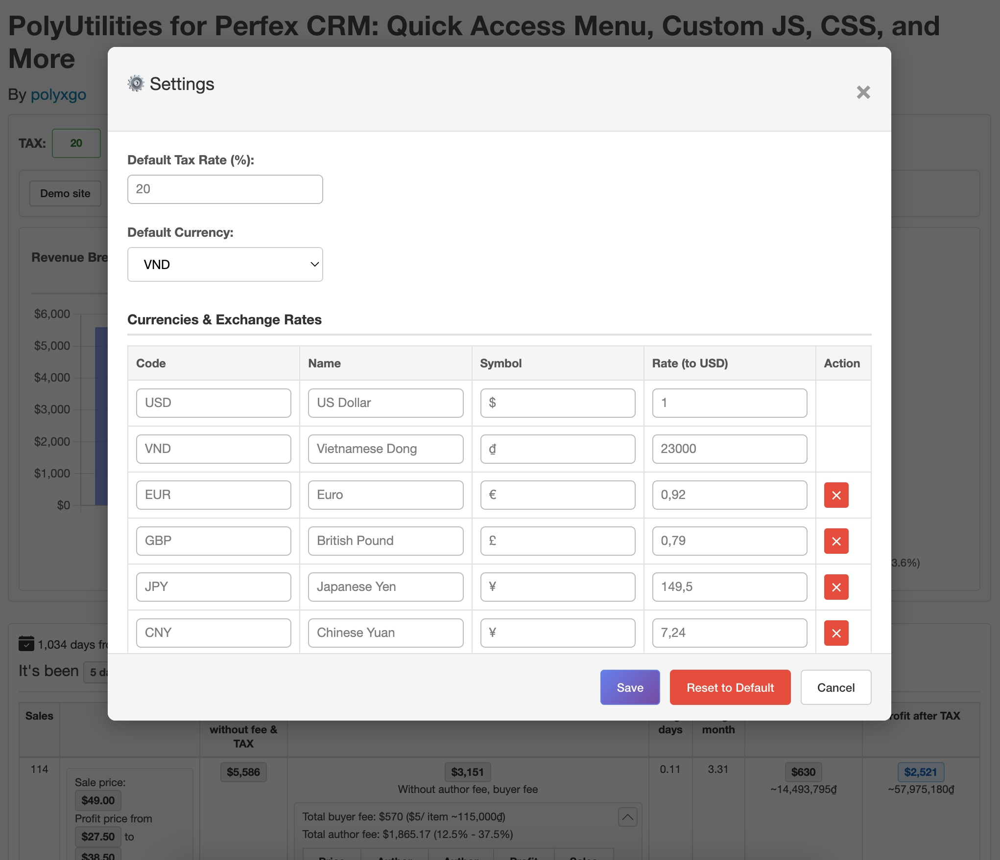

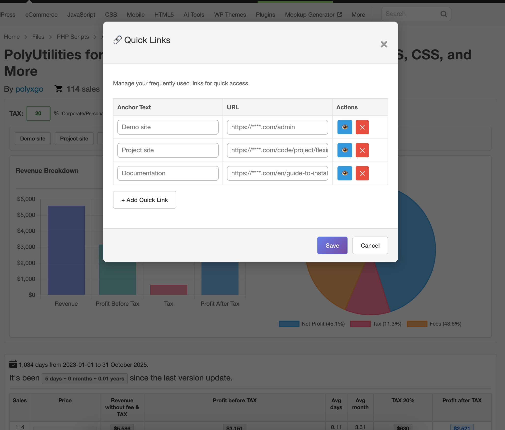

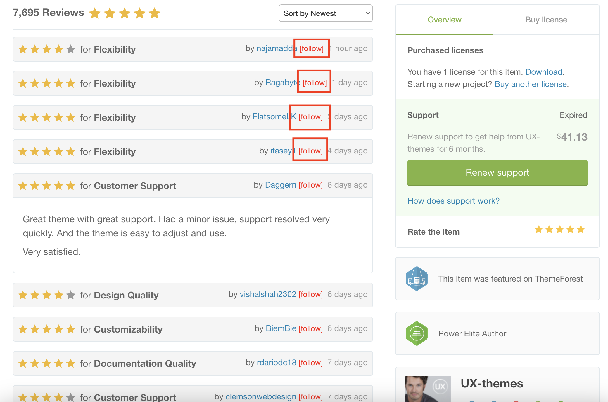

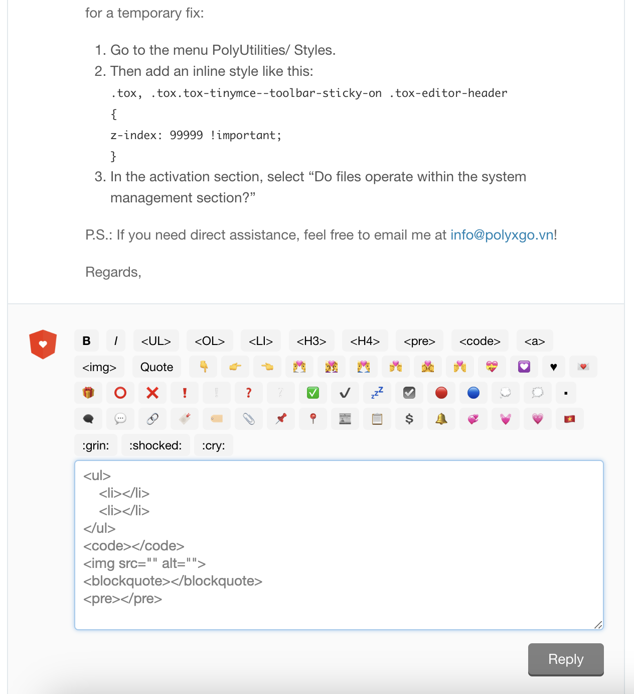

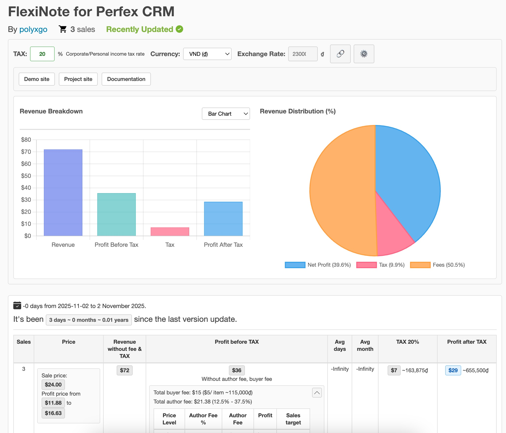

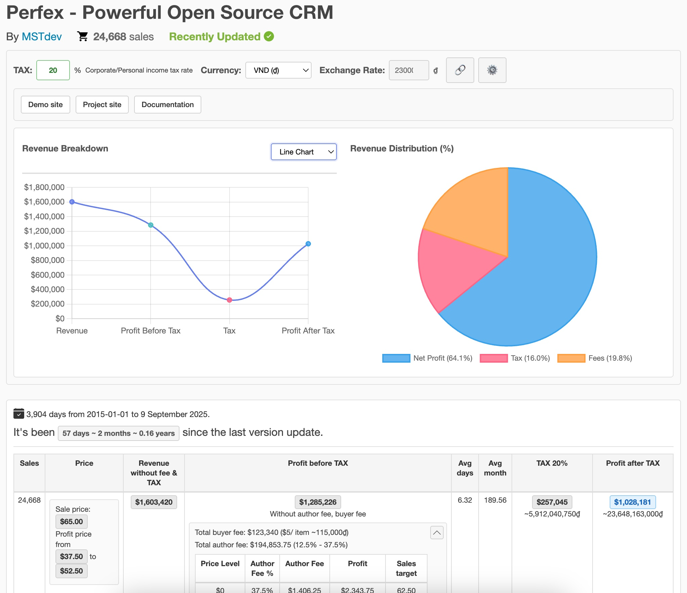

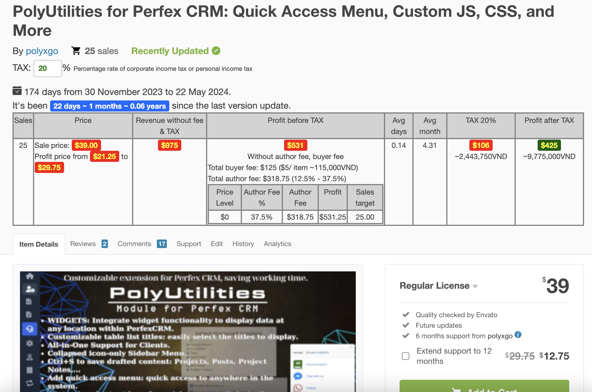

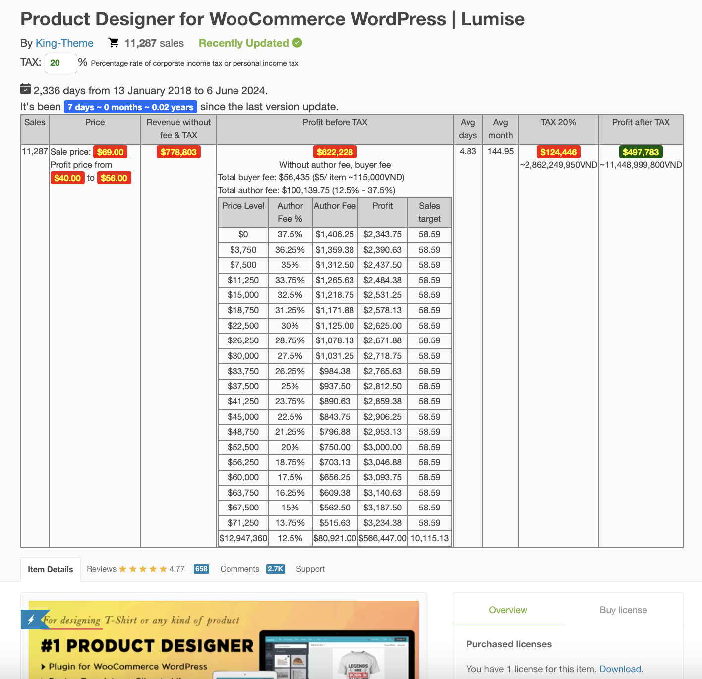

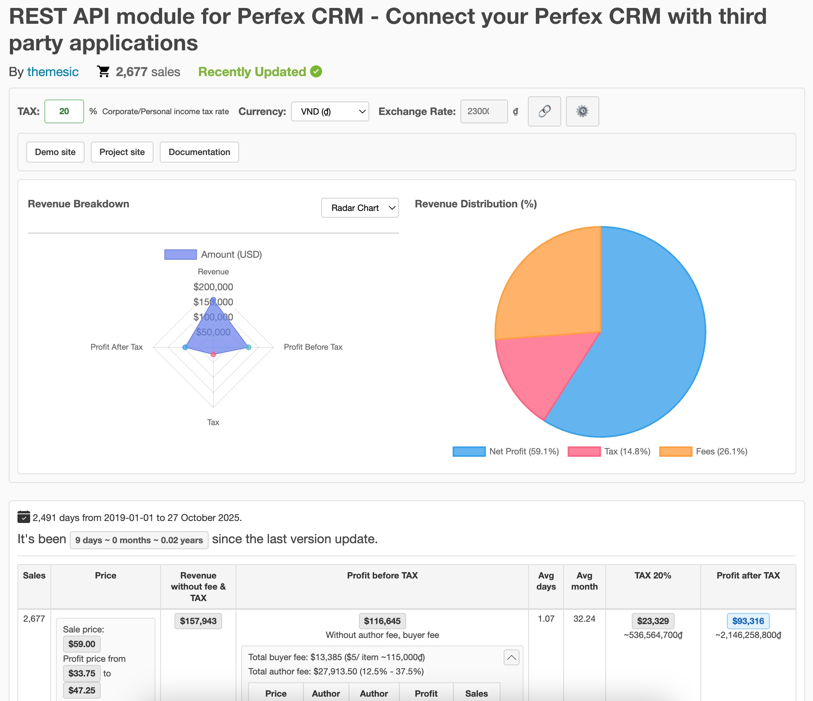

<div align="center">
  
**If you find this source code helpful, consider buying me a coffee to support my work!** ☕

<a href="https://paypal.me/polyxgo" target="_blank">
  
</a>

</div>

<!-- HeraSpec Section -->
## HeraSpec Development

This project uses [HeraSpec](https://github.com/your-org/heraspec) for spec-driven development.

### Quick Start

```bash
# Initialize HeraSpec (if not already done)
heraspec init

# List active changes
heraspec list

# View a change
heraspec show <change-name>

# Validate changes
heraspec validate <change-name>
```

### Project Structure

- `heraspec/project.md` - Project overview and configuration
- `heraspec/specs/` - Source of truth specifications
- `heraspec/changes/` - Active changes in progress
- `heraspec/skills/` - Reusable skills for AI agents
- `AGENTS.heraspec.md` - AI agent instructions

### Working with Changes

1. **Create a change**: Ask AI to create a HeraSpec change, or create manually
2. **Refine specs**: Review and update delta specs in `heraspec/specs/<change-name>/`
3. **Implement**: Follow tasks in `heraspec/changes/<change-name>/tasks.md`
4. **Archive**: Run `heraspec archive <change-name> --yes` when complete

### Skills

Add skills to your project:

```bash
# List available skills
heraspec skill list

# Add a skill
heraspec skill add ui-ux
heraspec skill add unit-test

# View skill details
heraspec skill show ui-ux
```

For more information, see the [HeraSpec documentation](https://github.com/your-org/heraspec/docs).

---

*This section is automatically updated by `heraspec init`. Last updated: 2026-01-27*